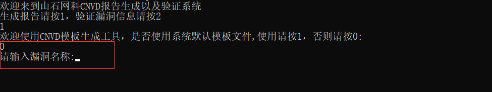
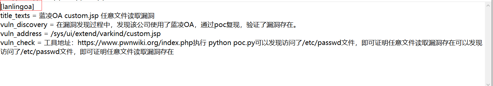
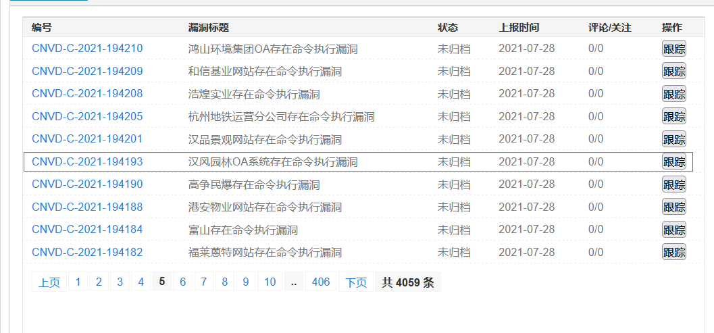
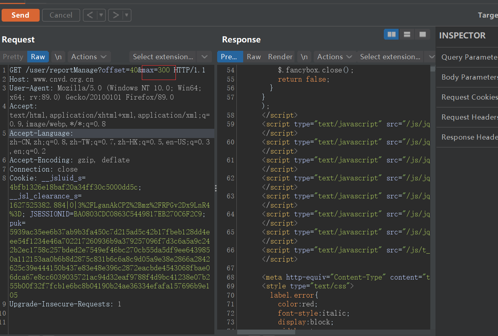
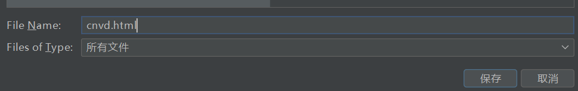

# 山石网科CNVD工具

山石网科CNVD工具是用于CNVD报告自动化生成以及漏洞是否通过验证的工具，使用者可以通过不同的模块灵活使用功能，并且该工具被封装为EXE文件，简单易上手，下面是该工具的使用说明：

# 使用前

工具依赖于python第三方库python-docx库，并使用python3环境进行编写,建议使用python3环境进行编译。

## 安装配置使用环境

在工具同级目录下存在requirement.txt文件，使用者通过cmd命令行输入命令

```shell 
pip install -r requirement.txt
```

 即可安装第三方依赖库！

# 使用中

工具使用流程图如下所示：

.png)

## 自动化生成报告

### 文档初始化

在根目录下预设有company.txt以及pwned.txt两个文件，其中company.txt保存存在漏洞的公司名称，相对应的pwned.txt保存对应的IP地址。

切记：<font color="red"> **公司名称以及IP地址需要一一对应**</font> 

### 使用说明

运行main.exe程序

输入指令1进入到生成报告模板


### 使用预设模板文件生成报告

1. 使用预定义模块可根据提示输入指令1 进行生成

   

2.在截图中显示的编号信息是同级目录下CNVD.ini文件中相关配置信息，使用者可自定义配置

选择需要模块编号进行生成报告，报告输出在工具同级目录下

### 生成自定义配置

进入到模板生成模块后选择**0**进行到自定义配置模块



依次输入漏洞名称，漏洞发现，漏洞地址以及漏洞证明信息后，输入配置名称，请勿与已存在配置名称重复，配置名称可在CNVD.ini中查看，红框处即为配置名称。



保存后即可根据自定义配置进行进行生成报告或仅保存配置信息！

## 漏洞有效性验证查询功能

该功能设置是为了验证CNVD提交的漏洞有效性统计，使用简单方便，下面开始使用说明

### 前提条件

使用者需要保存存在漏洞信息CNVD界面，用于数据源的读取

### 如何保存HTML数据源

1.首先登陆 https://www.cnvd.org.cn 进入到用户界面，首先找到使用者挖掘漏洞的漏洞界面，以汉风园林OA系统存在命令执行漏洞为例							 							

此时URl链接应与https://www.cnvd.org.cn/user/reportManage?offset=10&max=10  类似,使用burp抓取该链接的数据包，修改max的值为理想数值



2.在response界面点击右键选择Copy to file字段，保存文件为**cnvd.html**文件，将文件放到工具同级目录下即可,文件名一定是这个，其他的会报错！



### 使用说明

运行main.exe后输入指令2后在同级目录下生成xml文件，打开即你对应的CNVD提交信息


# 结尾

Author：whale3070 ,muyu


有啥子需求，尽管提，看心情增加！ 


<font size="60" color="red">**拜拜**</font>


